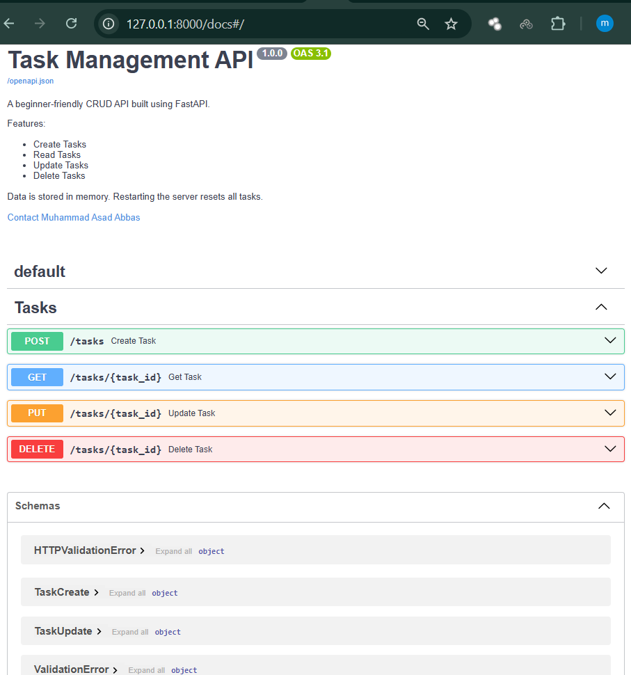

# Task Management API

A beginner-friendly REST API built with **FastAPI**.

## Features

- Create Tasks
- Read Tasks
- Update Tasks
- Delete Tasks
- Automatic Swagger Documentation
- In-Memory Data Storage

---

## Technologies Used

- Python 3
- FastAPI
- Uvicorn
- Pydantic
- Git
- GitHub

---

## Installation

Clone the repository

```bash
git clone https://github.com/<your-username>/fastapi-task-api.git
```

Go inside the project

```bash
cd fastapi-task-api
```

Create virtual environment

```bash
python -m venv venv
```

Activate

Windows

```bash
venv\Scripts\activate
```

Install dependencies

```bash
pip install -r requirements.txt
```

Run server

```bash
uvicorn app:app --reload
```

---

## API Documentation

Swagger UI

```
http://127.0.0.1:8000/docs
```
## Swagger Preview


---

## Endpoints

| Method | Endpoint | Description |
|---------|----------|-------------|
| GET | / | API Information |
| GET | /health | Health Check |
| GET | /tasks | Get All Tasks |
| GET | /tasks/{id} | Get Single Task |
| POST | /tasks | Create Task |
| PUT | /tasks/{id} | Update Task |
| DELETE | /tasks/{id} | Delete Task |

---

## Example Request

```bash
curl -X POST http://127.0.0.1:8000/tasks \
-H "Content-Type: application/json" \
-d "{\"title\":\"Learn FastAPI\"}"
```

---

## Example Response

```json
{
  "id": 4,
  "title": "Learn FastAPI",
  "done": false
}
```

---

## Project Structure

```
task-api/
│
├── app.py
├── requirements.txt
├── README.md
├── swagger-ui.png
├── .gitignore
└── venv/
```

---

## Author

Muhammad Asad Abbas